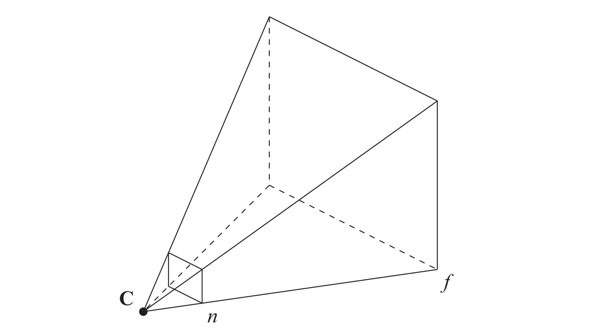
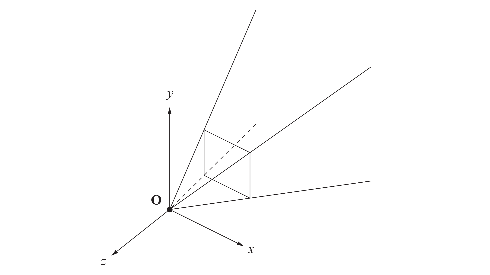
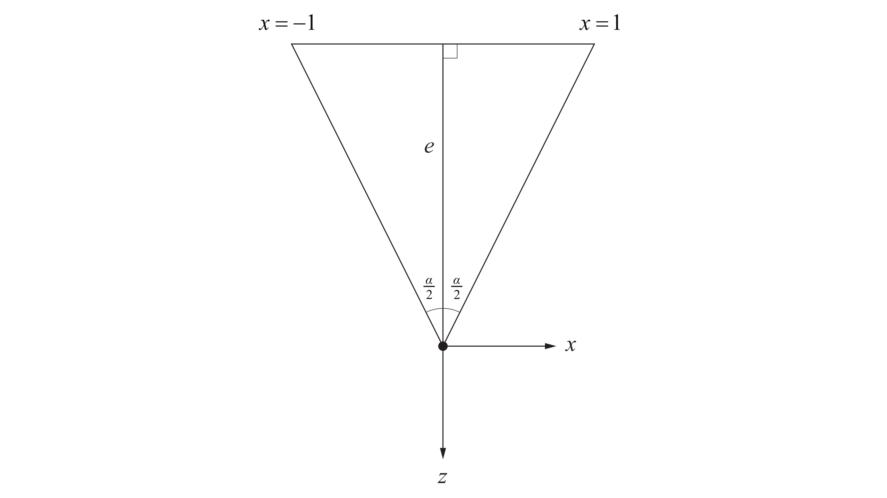
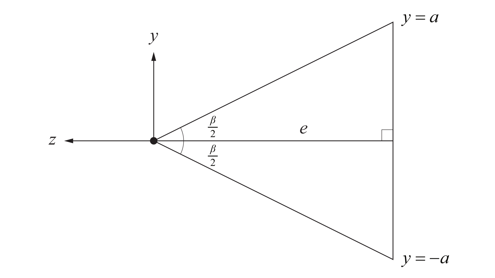
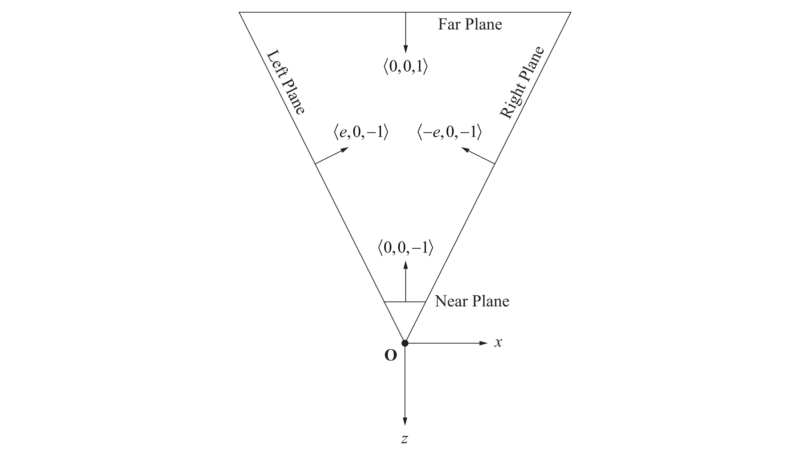
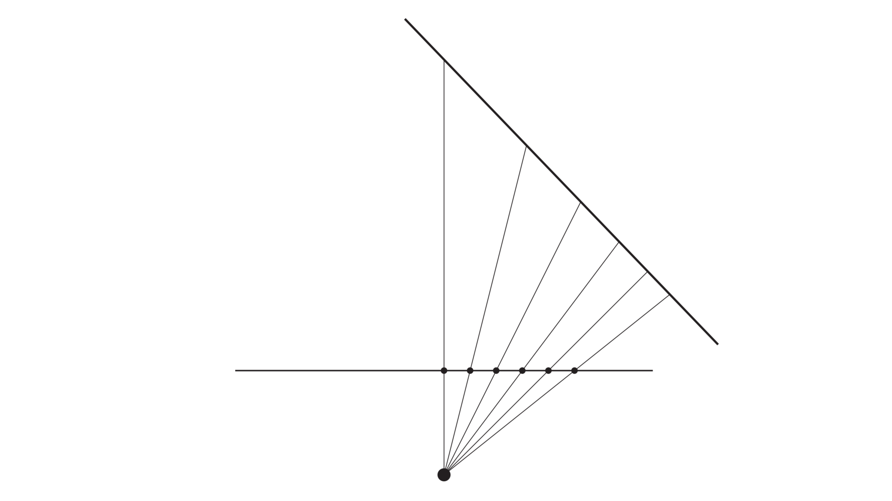
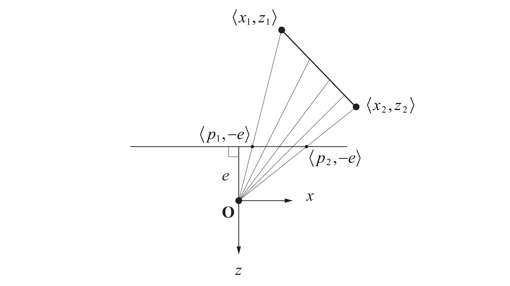

> This chapter develops the mathematics that describe lines and planes in threedimensional space, then introduce the view frustum and examine some of the important mathematics governing the virtual camera through which we see our game universe.

## 1. LINES IN 3D SPACE

给定 3D 点 $\mathbf{p}_{1}$ 和 $\mathbf{p}_{2}$ ，可定义经过两点的直线如下：

$$
\mathbf{p}(t) = (1-t) \mathbf{p}_{1} + t\mathbf{p}_{2} \quad (t\in \mathbb{R})
$$

记 $\mathbf{s}=\mathbf{p}_{1}$ ，$\mathbf{v}=\mathbf{p}_{2}-\mathbf{p}_{1}$ ，上式可改写成：

$$
\mathbf{p}(t) = \mathbf{s} + t\mathbf{v}
$$

若约束 $t\in[0,+\infty)$ ，则其表示一条 **射线（Ray）**，其中 $\mathbf{s}$ 为端点，$\mathbf{v}$ 为方向。

### Distance Between a Point and a Line

给定点 $\mathbf{q}$ 和直线 $\mathbf{p}(t)=\mathbf{s}+t\mathbf{v}$ ，点到直线的距离 $d$ 可由勾股定理得出，计算和示意图如下：

$$
\begin{align}
d^{2} &= (\mathbf{q}-\mathbf{s})^{2} - [\operatorname{proj}_{\mathbf{v}}(\mathbf{q}-\mathbf{s})]^{2} \\
&= (\mathbf{q}-\mathbf{s})^{2} - \left[ \frac{(\mathbf{q}-\mathbf{s})\cdot \mathbf{v}}{\mathbf{v}^{2}} \mathbf{v} \right]^{2}
\end{align}
$$

即：

$$
d = \sqrt{ (\mathbf{q}-\mathbf{s})^{2} - \frac{[(\mathbf{q}-\mathbf{s})\cdot \mathbf{v}]^{2}}{\mathbf{v}^{2}} }
$$

/// caption
Figure 1:  点 $\mathbf{q}$ 到直线 $\mathbf{s}+t\mathbf{v}$ 距离 $d$ 计算示意图。
///

### Distance Between Two Lines

在三维中，两条直线有三种位置关系：平行、相交、**异面（Skew）**。下面推导两条异面直线之间的最小距离：

给定两条直线：

$$
\begin{align}
\mathbf{p}_{1}(t_{1}) &= \mathbf{s}_{1} + t_{1}\mathbf{v}_{1}\quad (t_{1}\in \mathbb{R}) \\
\mathbf{p}_{2}(t_{2}) &= \mathbf{s}_{2} + t_{2}\mathbf{v}_{2}\quad (t_{2}\in \mathbb{R})
\end{align}
$$

两点 $\mathbf{p}_{1}(t_{1}),\mathbf{p}_{2}(t_{2})$ 之间的平方距离可记为如下函数：

$$
\begin{align}
f(t_{1},t_{2}) &= \Vert \mathbf{p}_{1}(t_{1}) - \mathbf{p}_{2}(t_{2}) \Vert^{2} \\
&= \mathbf{s}_{1}^{2}+t_{1}^{2}\mathbf{v}_{1}^{2}+2t_{1}\mathbf{s}_{1}\cdot\mathbf{v}_{1}+\mathbf{s}_{2}^{2}+t_{2}^{2}\mathbf{v}_{2}^{2}+2t_{2}\mathbf{s}_{2}\cdot \mathbf{v}_{2} \\
&\qquad -2(\mathbf{s}_{1}\cdot \mathbf{s}_{2}+t_{1}\mathbf{v}_{1}\cdot \mathbf{s}_{2}+t_{2}\mathbf{v}_{2}\cdot \mathbf{s}_{1}+t_{1}t_{2}\mathbf{v}_{1}\cdot \mathbf{v}_{2})
\end{align}
$$

最小值在 $f$ 关于 $t_{1},t_{2}$ 偏导数为 $0$ 时取得，即：

$$
\begin{align}
\frac{\partial f}{\partial t_{1}} &= 2t_{1}\mathbf{v}_{1}^{2}+2\mathbf{s}_{1}\cdot \mathbf{v}_{1}-2\mathbf{v}_{1}\cdot \mathbf{s}_{2}-2t_{2}\mathbf{v}_{1}\cdot \mathbf{v}_{2} = 0 \\
\frac{\partial f}{\partial t_{2}} &= 2t_{2}\mathbf{v}_{2}^{2}+2\mathbf{s}_{2}\cdot \mathbf{v}_{2}-2\mathbf{v}_{2}\cdot \mathbf{s}_{1}-2t_{1}\mathbf{v}_{1}\cdot \mathbf{v}_{2} = 0
\end{align}
$$

将如上方程转化为矩阵形式：

$$
\begin{bmatrix}
\mathbf{v}_{1}^{2} & -\mathbf{v}_{1}\cdot \mathbf{v}_{2} \\
\mathbf{v}_{1}\cdot \mathbf{v}_{2} & -\mathbf{v}_{2}^{2}
\end{bmatrix} \begin{bmatrix}
t_{1} \\
t_{2}
\end{bmatrix} = \begin{bmatrix}
(\mathbf{s}_{2}-\mathbf{s}_{1})\cdot \mathbf{v}_{1} \\
(\mathbf{s}_{2}-\mathbf{s}_{1})\cdot \mathbf{v}_{2}
\end{bmatrix}
$$

求解得：

$$
\begin{align}
\begin{bmatrix}
t_{1} \\
t_{2}
\end{bmatrix} &= \begin{bmatrix}
\mathbf{v}_{1}^{2} & -\mathbf{v}_{1}\cdot \mathbf{v}_{2} \\
\mathbf{v}_{1}\cdot \mathbf{v}_{2} & -\mathbf{v}_{2}^{2}
\end{bmatrix}^{-1} \begin{bmatrix}
(\mathbf{s}_{2}-\mathbf{s}_{1})\cdot \mathbf{v}_{1} \\
(\mathbf{s}_{2}-\mathbf{s}_{1})\cdot \mathbf{v}_{2}
\end{bmatrix} \\
&= \frac{1}{(\mathbf{v}_{1}\cdot \mathbf{v}_{2})^{2}-\mathbf{v}_{1}^{2}\mathbf{v}_{2}^{2}} \begin{bmatrix}
-\mathbf{v}_{2}^{2} & \mathbf{v}_{1}\cdot \mathbf{v}_{2} \\
-\mathbf{v}_{1}\cdot \mathbf{v}_{2} & \mathbf{v}_{1}^{2}
\end{bmatrix} \begin{bmatrix}
(\mathbf{s}_{2}-\mathbf{s}_{1})\cdot \mathbf{v}_{1} \\
(\mathbf{s}_{2}-\mathbf{s}_{1})\cdot \mathbf{v}_{2}
\end{bmatrix}
\end{align}
$$

回代到 $f$ 表达式并开根号即可得到最小距离。注意到若 $(\mathbf{v}_{1}\cdot \mathbf{v}_{2})^{2}=\mathbf{v}_{1}^{2}\mathbf{v}_{2}^{2}$ ，则两条直线平行，最小距离转化为点到直线距离。

## 2. PLANES IN 3D SPACE

给定 3D 点 $\mathbf{p}$ 和法向量 $\mathbf{n}$ ，经过点 $\mathbf{p}$ 并垂直于 $\mathbf{n}$ 的平面定义为满足 $\mathbf{n}\cdot(\mathbf{q}-\mathbf{p})=0$ 的点集 $\{\mathbf{q}\}$ 。其方程通常写为：

$$
Ax + By + Cz + D = 0
$$

其中 $\mathbf{n}=\left< A,B,C \right>$ ，$D=-\mathbf{n}\cdot \mathbf{p}$ 。原点到平面的距离由 $\left| D \right|/\Vert\mathbf{n}\Vert$ 给出。当 $\mathbf{n}$ 为单位向量时，方程：

$$
d = \mathbf{n}\cdot \mathbf{q} + D
$$

给出任意点 $\mathbf{q}$ 到平面的带符号距离。特别的，$\left| D \right|$ 为原点到平面距离。

使用 4D 齐次坐标表示平面会更简洁：

记 $\mathbf{L}:=\left< \mathbf{n},D \right>=\left< A,B,C,D \right>$ ，$\mathbf{Q}:=\left< \mathbf{q},1 \right>$ ，则平面方程为 $\mathbf{L}\cdot \mathbf{Q}=0$ ，距离方程为 $d=\mathbf{L}\cdot \mathbf{Q}$ 。

### Intersection of a Line and a Plane

给定直线 $\mathbf{p}(t)=\mathbf{s}+t\mathbf{v}$ 和平面 $\left< \mathbf{n},D \right>$ ，可求解如下方程得到直线和平面的交点：

$$
\mathbf{n}\cdot \mathbf{p}(t) + D = 0
$$

替换 $\mathbf{p}(t)=\mathbf{s}+t\mathbf{v}$ 有：

$$
\mathbf{n}\cdot \mathbf{s} + (\mathbf{n}\cdot \mathbf{v})t + D = 0
$$

求解得：

$$
t = \frac{-(\mathbf{n}\cdot \mathbf{s} + D)}{\mathbf{n}\cdot \mathbf{v}}
$$

回代到 $\mathbf{p}(t)$ 表达式即得交点。注意到若 $\mathbf{n}\cdot \mathbf{v}=0$ ，直线和平面法向垂直。此时若 $\mathbf{n}\cdot \mathbf{s}+D=0$ 则直线在平面内，否则直线与平面平行。

同理有 4D 齐次坐标表示：

记 $\mathbf{S}:=\left< \mathbf{s},1 \right>$ ，$\mathbf{V}:=\left< \mathbf{v},0 \right>$ ，交点方程为：

$$
t = -\frac{\mathbf{L}\cdot \mathbf{S}}{\mathbf{L}\cdot \mathbf{V}}
$$

### Intersection of Three Planes

给定三个任意平面 $\mathbf{L}_{1}=\left< \mathbf{n}_{1},D_{1} \right>,\mathbf{L}_{2}=\left< \mathbf{n}_{2},D_{2} \right>,\mathbf{L}_{3}=\left< \mathbf{n}_{3},D_{3} \right>$ ，三个平面的交点 $\mathbf{Q}$ 由如下方程组给出：

$$
\begin{align}
\mathbf{L}_{1}\cdot \mathbf{Q} &= 0 \\
\mathbf{L}_{2}\cdot \mathbf{Q} &= 0 \\
\mathbf{L}_{3}\cdot \mathbf{Q} &= 0
\end{align}
$$

写成矩阵形式有：

$$
\mathbf{M}\mathbf{q} = \begin{bmatrix}
-D_{1} \\
-D_{2} \\
-D_{3}
\end{bmatrix}
$$

其中 $\mathbf{M}$ 为：

$$
\mathbf{M} = \begin{bmatrix}
(\mathbf{n}_{1})_{x} & (\mathbf{n}_{1})_{y} & (\mathbf{n}_{1})_{z} \\
(\mathbf{n}_{2})_{x} & (\mathbf{n}_{2})_{y} & (\mathbf{n}_{2})_{z} \\
(\mathbf{n}_{3})_{x} & (\mathbf{n}_{3})_{y} & (\mathbf{n}_{3})_{z}
\end{bmatrix}
$$

若 $\mathbf{M}$ 可逆，求解可得交点 $\mathbf{q}$ ：

$$
\mathbf{q} = \mathbf{M}^{-1}\begin{bmatrix}
-D_{1} \\
-D_{2} \\
-D_{3}
\end{bmatrix}
$$

若 $\det \mathbf{M}=0$ 即 $\mathbf{M}$ 奇异，此时三个法向量共面，如下图所示：

/// caption
Figure 2:  三平面未交于一点示意图。
///

三平面交点方程可以解决如下两平面相交直线问题：

给定两个不平行平面 $\mathbf{L}_{1}=\left< \mathbf{n}_{1},D_{1} \right>,\mathbf{L}_{2}=\left< \mathbf{n}_{2},D_{2} \right>$ ，会交于一条直线。直线方向 $\mathbf{v}$ 与两个平面的法向垂直，从而可表示为 $\mathbf{v}=\mathbf{n}_{1}\times \mathbf{n}_{2}$ 。为完全表示该直线，还需直线上一点。为此构造平面 $\mathbf{L}_{3}=\left< \mathbf{v},0 \right>$ ，利用三平面交点方程可得：

$$
\mathbf{q} = \begin{bmatrix}
(\mathbf{n}_{1})_{x} & (\mathbf{n}_{1})_{y} & (\mathbf{n}_{1})_{z} \\
(\mathbf{n}_{2})_{x} & (\mathbf{n}_{2})_{y} & (\mathbf{n}_{2})_{z} \\
\mathbf{v}_{x} & \mathbf{v}_{y} & \mathbf{v}_{z}
\end{bmatrix}^{-1} \begin{bmatrix}
-D_{1} \\
-D_{2} \\
0
\end{bmatrix}
$$

相交直线即为 $\mathbf{p}(t)=\mathbf{q}+t\mathbf{v}$ 。示意图如下：

/// caption
Figure 3:  两平面相交于方向为 $\mathbf{v}$ 的直线。构造第三个平面可找到直线上一点。
///

### Transforming Planes

给定 $3\times 3$ 矩阵 $\mathbf{M}$ 和 3D 平移向量 $\mathbf{T}$ ，对于平面 $\mathbf{L}=\left< \mathbf{n},D \right>$ 探究变换后的平面表达式。

由 [Chap.3](chapter3-transforms.md#5-transforming-normal-vectors) 中法向量变换方程可知，变换后的法向量为 $\mathbf{n}'=(\mathbf{M}^{-1})^\mathsf{T}\mathbf{n}$ 。设 $\mathbf{p}$ 为原平面上一点，则变换后的对应点为 $\mathbf{p}'=\mathbf{M}\mathbf{p}+\mathbf{T}$ ，计算有：

$$
\begin{align}
D' &= -\mathbf{n}'\mathbf{p}' \\
&= -((\mathbf{M}^{-1})^\mathsf{T}\mathbf{n})\cdot(\mathbf{M}\mathbf{p}+\mathbf{T}) \\
&= D - \mathbf{n}\cdot \mathbf{M}^{-1}\mathbf{T}
\end{align}
$$

[Chap.3](chapter3-transforms.md#four-dimensional-transforms) 中给出了 4D 齐次坐标下的变换矩阵 $\mathbf{F}$ ，计算其逆转置有：

$$
(\mathbf{F}^{-1})^\mathsf{T} = \left[ \begin{array}{ccc:c}
{} & {} & {} & {} \\
{} & (\mathbf{M}^{-1})^\mathsf{T} & {} & \mathbf{0} \\
{} & {} & {} & {} \\
\hdashline
{} & -\mathbf{M}^{-1}\mathbf{T} & {} & 1
\end{array} \right] 
$$

结合 $\mathbf{n}'$ 和 $D'$ 表达式可知，平面 $\mathbf{L}=\left< \mathbf{n},D \right>$ 变换后的表达式 $\mathbf{L}'=\left< \mathbf{n}',D' \right>$ 为：

$$
\mathbf{L}'=(\mathbf{F}^{-1})^\mathsf{T}\mathbf{L}
$$

即平面为 4D 坐标中的协变向量。

## 3. THE VIEW FRUSTUM

**视锥体（View Frustum）** ，形如金字塔，顶点位于摄像机位置，表示三维场景中通过屏幕可见的所有空间体积。如下图所示：

/// caption
Figure 4:  视锥体示意图。由近平面（距离 $n$ ），远平面（距离 $f$ ），四个经过相机位置 $\mathbf{C}$ 的边平面包围。
///

视锥体由六个平面包围：

- 四个对应屏幕边缘，称为左、右、上、下锥平面。
- 两个对应最近和最远可视物体范围，称为近锥平面和远锥平面。

视锥体对齐于 **相机空间（Camera Space）**，该空间以相机位置为原点，$x$ 轴指向右，$y$ 轴指向上，$z$ 轴方向决定于 3D 图形库。采用 OpenGL 库的规定，$z$ 轴指向相机朝向的反向。如下图所示，该坐标系统为右手系：

/// caption
Figure 5:  OpenGL 中的相机空间示意图。
///

### Field of View

**投影平面（Projection Plane）** 为垂直于相机朝向，距离为 $e$ ，并与左右锥平面分别相交于 $x=-1$ 和 $x=1$ 的平面。其中，距离 $e$ 称为相机 **焦距（Focal Length）**，其依赖于锥平面形成的角度 $\alpha$ 。角度 $\alpha$ 称为 **水平视场角（Horizontal Field of View Angle）**。如下图所示：

/// caption
Figure 6:  投影平面到相机的距离 $e$ 依赖于水平视场角 $\alpha$ 。
///

由三角关系可知：

$$
e = \frac{1}{\tan(\alpha/2)}
$$

即更大的视场角对应更短的焦距。相机可以通过减小视场角来实现“拉近”效果，这相当于使用更长的焦距。

同理，可定义 **垂直视场角（Vertical Field of View）**：

设上下锥平面与投影平面相交于 $y=\pm a$ ，其中 $a$ 称为显示器的 **纵横比（Aspect Ratio）**，则垂直视场角 $\beta$ 为：

$$
\beta = 2\tan^{-1}(a/e)
$$

如下图所示：

/// caption
Figure 7:  垂直视场角 $\beta$ 依赖于纵横比 $a$ 。
///

### Frustum Planes

六个锥平面的法向方向和四维向量表示由如下所示：

/// caption
Figure 8:  OpenGL 相机空间中锥平面法向方向示意图。
///

| **Plane** |                                $\langle \mathbf{n},D\rangle$                                |
| :-------: | :-----------------------------------------------------------------------------------------: |
|   Near    |                                 $\langle 0,0,-1,-n\rangle$                                  |
|    Far    |                                  $\langle 0,0,1,f\rangle$                                   |
|   Left    |   $\left\langle \dfrac{e}{\sqrt{e^2+1}},\,0,\,-\dfrac{1}{\sqrt{e^2+1}},\,0\right\rangle$    |
|   Right   |   $\left\langle -\dfrac{e}{\sqrt{e^2+1}},\,0,\,-\dfrac{1}{\sqrt{e^2+1}},\,0\right\rangle$   |
|  Bottom   | $\left\langle 0,\,\dfrac{e}{\sqrt{e^2+a^2}},\,-\dfrac{a}{\sqrt{e^2+a^2}},\,0\right\rangle$  |
|    Top    | $\left\langle 0,\,-\dfrac{e}{\sqrt{e^2+a^2}},\,-\dfrac{a}{\sqrt{e^2+a^2}},\,0\right\rangle$ |

## 4. Perspective-Correct Interpolation

为渲染三角形到屏幕上，3D 图形处理器会逐扫描线地对其进行光栅化。当绘制单条扫描线时，每个像素处的信息由左右端点携带信息插值导出。该插值通常为非线性，如下图所示：

/// caption
Figure 9:  投影平面上的等距步长，随与相机距离增大，对应于三角形表面上更大的步长。因此正确的插值为非线性的。
///

### Depth Interpolation

考虑位于 $x-z$ 平面的扫描线段，如下图所示，探究 $z$ 坐标（深度值）的正确插值方式：

/// caption
Figure 10:  扫描线段由投影平面等距投射光线采样示意图。
///

设扫描线段方程为：

$$
ax + bz = c \quad (c\neq0)
$$

给定扫描线段上一点 $\left< x,z \right>$ ，从原点向其投射光线，与投影平面交于 $\left< p,-e \right>$ ，由相似关系有：

$$
\frac{p}{x} = \frac{-e}{z}
$$

求解 $x$ 后代入线段方程有：

$$
\frac{1}{z} = -\frac{ap}{ce} + \frac{b}{c}
$$

设扫描线段两顶点为 $\left< x_{1},z_{1} \right>$ 和 $\left< x_{2},z_{2} \right>$ ，对应投影平面点为 $\left< p_{1},-e \right>$ 和 $\left< p_{2},-e \right>$ 。令 $p=(1-t)p_{1}+tp_{2}$ ，由上式计算有：

$$
\begin{align}
\frac{1}{z} &= -\frac{ap}{ce} + \frac{b}{c} \\
&= -\frac{ap_{1}}{ce}(1-t)-\frac{ap_{2}}{ce}t + \frac{b}{c} \\
&= \left( -\frac{ap_{1}}{ce} + \frac{b}{c} \right)(1-t) + \left( -\frac{ap_{2}}{ce} + \frac{b}{c} \right)t \\
&= \frac{1}{z_{1}}(1-t) + \frac{1}{z_{2}}t
\end{align}
$$

即 $z$ 坐标的倒数为线性插值。

### Vertex Attribute Interpolation

顶点除深度外，通常仍带有如光照颜色和纹理坐标等信息，统称为 **顶点属性（Vertex Attribute）**。下面探究顶点属性的正确插值方式：

设扫描线段两顶点深度值为 $z_{1},z_{2}$ ，同时带有标量属性 $b_{1},b_{2}$ 。考虑扫描线上深度值为 $z$ ，标量属性为 $b$ 的一点，由相似关系有：

$$
\frac{b-b_{1}}{b_{2}-b_{1}} = \frac{z-z_{1}}{z_{2}-z_{1}}
$$

代入深度插值式：

$$
z = \frac{1}{\frac{1}{z_{1}}(1-t)+\frac{1}{z_{2}}t}
$$

计算有：

$$
\begin{align}
b &= \frac{\frac{b_{1}}{z_{1}}(1-t)+\frac{b_{2}}{z_{2}}t}{\frac{1}{z_{1}}(1-t)+\frac{b_{2}}{z_{2}}t} \\
&= z\left[ \frac{b_{1}}{z_{1}}(1-t)+\frac{b_{2}}{z_{2}}t \right] 
\end{align}
$$

整理得：

$$
\frac{b}{z} = \frac{b_{1}}{z_{1}}(1-t) + \frac{b_{2}}{z_{2}}t
$$

即 $b/z$ 为线性插值。

## 5. Projections